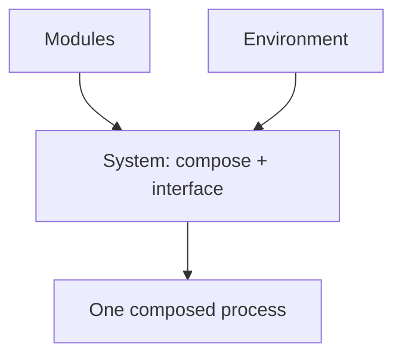

# Architecture

> Code is truth — this page describes the pattern; the source and YAML on `main` win on conflict. Implemented systems live under [Systems](systems/index.md).

## Systems are the top level

A physical system interfaces modules together into a working rover. It owns
the composing entry point and executor, the system-specific model, driver,
and supervisor, plus its parameters, launch, bridge config, model, and
environment binding. Modules never name a system or environment; the system
chooses which modules to compose.

## Examples

- Alpha today composes localisation producers plus the Kalman engine,
  Ackermann control, and common helpers, with its own driver, ESKF model,
  and supervisor, into one process on `lunar_surface`. See
  [Systems/Alpha](systems/alpha/index.md) for its architecture.
- A future system would reuse the same modules with its own model, driver,
  parameters, and launch on the same or a new environment, without changing
  module code. See [Systems](systems/index.md) for the checklist.

## Executor

One executor owned by the system; each composed node keeps its
mutually-exclusive default callback group.

## Frames

Local estimators use `<system>/startup_fixed`, anchored under `map` by
ground truth alone.

## Dataflow

Producers feed the system ESKF; the filtered display estimate is never fed
back into the ESKF.
