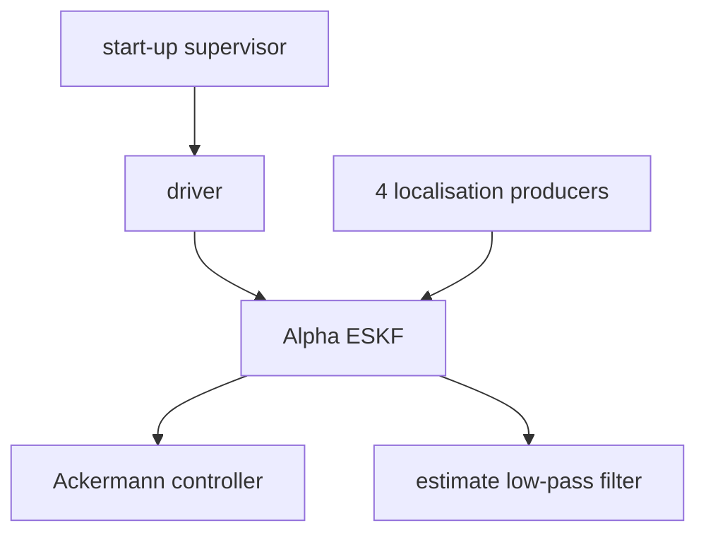

# Architecture

> Code is truth — this page describes; the source and YAML on `main` win on conflict.

Skeleton only: full per-module pages and diagrams arrive in later work
packages. Entry point is `src/systems/alpha/alpha_node/main.cpp`.

## AlphaNode composition

Placeholder. One `AlphaNode` process composes the driver, four localisation
producers, the Alpha ESKF, the Ackermann controller, the estimate low-pass
filter, and the start-up supervisor:

## Executor

Placeholder. One `MultiThreadedExecutor`; each composed node keeps its
mutually-exclusive default callback group.

## Frames

Placeholder. Local estimators use `<system>/startup_fixed`, anchored under
`map` by ground truth alone.

## Dataflow

Placeholder. Producers feed the ESKF; the filtered estimate topic is never
fed back into the ESKF.
