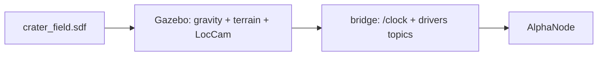

# Lunar crater field

> Code is truth — values below describe; source linked wins on conflict.

Purpose: the Moon world Alpha drives on — low gravity, rocky terrain, and
the LocCam stereo pair the visual odometry consumes. Default environment:
a bare launcher call resolves here.

Where: `environment/lunar/crater_field/crater_field.sdf`
([GitHub](https://github.com/richarJ2002/space_robotics_simulator/blob/main/environment/lunar/crater_field/crater_field.sdf)).

## Topics

World-provided sensor and clock streams cross the bridge (see
[Launch & bridge](../launch-bridge.md)); the only world topic this page
names is `/clock`. Timing-sensitive tools require exactly one `/clock`
publisher in the DDS domain.

## Key files

| Class / unit | Path | GitHub |
|---|---|---|
| World | `environment/lunar/crater_field/crater_field.sdf` | [link](https://github.com/richarJ2002/space_robotics_simulator/blob/main/environment/lunar/crater_field/crater_field.sdf) |
| Terrain mesh | `environment/lunar/crater_field/meshes/lunar_crater_environment.glb` | [link](https://github.com/richarJ2002/space_robotics_simulator/blob/main/environment/lunar/crater_field/meshes/lunar_crater_environment.glb) |

## Parameters

No ROS parameters. Gravity is lunar in the SDF; isolation defaults are
`ROS_DOMAIN_ID=73` and `GZ_PARTITION=space_robotics_simulator_${ROS_DOMAIN_ID}`.
Use the same values in every terminal.

