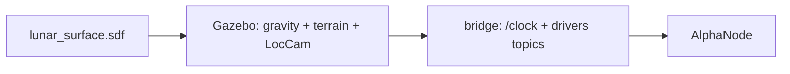

# Lunar surface

> Code is truth — values below describe; source linked wins on conflict.

Purpose: the Moon world Alpha drives on — low gravity, rocky terrain, and
the LocCam stereo pair the visual odometry consumes.

Where: `worlds/lunar_surface.sdf`
([GitHub](https://github.com/richarJ2002/lunar_simulator/blob/main/worlds/lunar_surface.sdf)).

## Topics

World-provided sensor and clock streams cross the bridge (see
[Launch & bridge](../launch-bridge.md)); the only world topic this page
names is `/clock`. Timing-sensitive tools require exactly one `/clock`
publisher in the DDS domain.

## Key files

| Class / unit | Path | GitHub |
|---|---|---|
| World | `worlds/lunar_surface.sdf` | [link](https://github.com/richarJ2002/lunar_simulator/blob/main/worlds/lunar_surface.sdf) |

## Parameters

No ROS parameters. Gravity is lunar in the SDF; isolation defaults are
`ROS_DOMAIN_ID=73` and `GZ_PARTITION=lunar_simulator_73` (partition
defaults to `lunar_simulator_${ROS_DOMAIN_ID}`). Use the same values in
every terminal.

