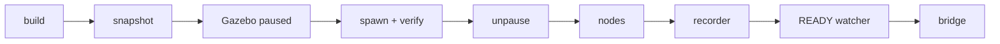

# Launch & bridge

> Code is truth — values below describe; scripts and YAML linked win on conflict.

Purpose: how a run starts and how ROS meets Gazebo. The full launcher
owns the whole sequence; `alpha_launch.py` alone starts nodes but spawns
no rover.

Where: `scripts/launch_simulator.sh`
([GitHub](https://github.com/richarJ2002/space_robotics_simulator/blob/main/scripts/launch_simulator.sh)),
`launch/alpha_launch.py`
([GitHub](https://github.com/richarJ2002/space_robotics_simulator/blob/main/launch/alpha_launch.py)),
`config/alpha/ros_gz_bridge.yaml`
([GitHub](https://github.com/richarJ2002/space_robotics_simulator/blob/main/config/alpha/ros_gz_bridge.yaml)).

## Launcher sequence

`./scripts/launch_simulator.sh [environment] [system] [--headless] [--rviz]
[--record-images]` runs, in order: build → run snapshot → spawn-SDF
generation → Gazebo start (paused) → spawn → verify → unpause → nodes →
recorder → READY watcher → bridge. Do not duplicate or reorder that
sequence in tests.

Defaults are `crater_field` + `alpha`, so a bare call launches Alpha on
crater_field. Each selector resolves in 3 steps: absolute path (must
exist), else CWD-relative path (if exists), else a bare name under
`environment/` (a world SDF) or `src/systems/` (a rover system). A bare
world name picks its variant dir's SDF (e.g. `crater_field` →
`environment/lunar/crater_field/crater_field.sdf`). Full authority is the
usage text in the script linked above. See
[Environments](environments/index.md) for the launcher matrix.

## `alpha_launch.py` limits

`ros2 launch space_robotics_simulator alpha_launch.py` starts Gazebo, `alpha_node`,
and the bridge — but contains no rover spawn action. Use it only when
model spawning is managed separately; it is not the full launcher.

## Bridge

`config/alpha/ros_gz_bridge.yaml` wires Gazebo topics to ROS. Raw
simulator traffic stays under `drivers/*` (IMU, joint states, wheel
commands, ground-truth odometry, LocCam images); public namespaces
(`/alpha/imu`, `/alpha/joint_states`, `/clock`, ...) face the nodes.
Full authority is the YAML link above — topic names only, no QoS claims.

