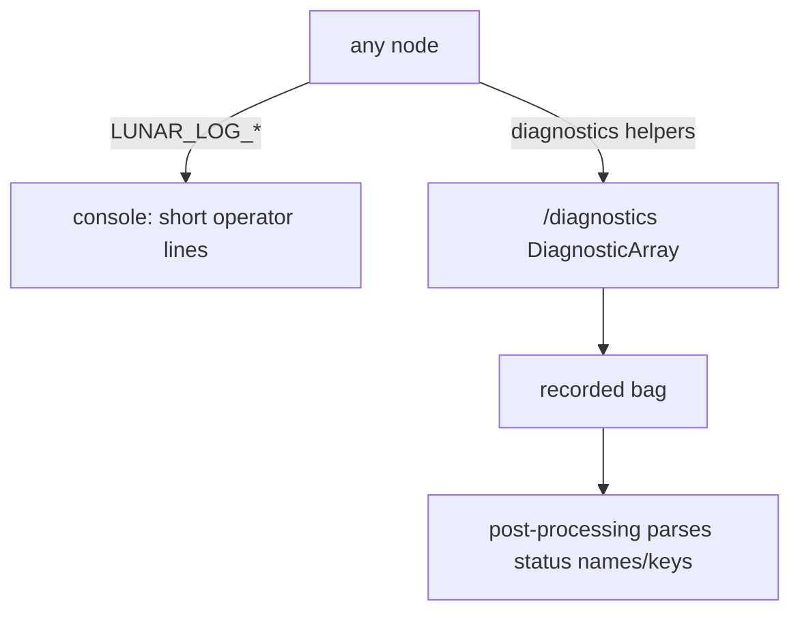

# Common

> Code is truth — values below describe; YAML/source linked wins on conflict.

Purpose: shared building blocks every node uses — wrapped console logging
and machine-readable diagnostics. Operator messages stay short on the
console; periodic counters, timings, and readiness live on the recorded
`/<system>/diagnostics` topic, not in log lines.

Where: `src/common/`
([GitHub](https://github.com/richarJ2002/lunar_simulator/blob/main/src/common/)):
`console/`
([GitHub](https://github.com/richarJ2002/lunar_simulator/blob/main/src/common/console/)),
`diagnostics/`
([GitHub](https://github.com/richarJ2002/lunar_simulator/blob/main/src/common/diagnostics/)).

## Topics

| Direction | Name |
|---|---|
| Out | `/alpha/diagnostics` (`diagnostic_msgs/DiagnosticArray`, per-node readiness `ready`/`reason`) |

Published from a simulation-time timer via the `diagnostics/` helpers and
parsed by `post_processing/python_tools/diagnostics/bag_diagnostics.py` —
change status names and keys on both sides together.

## Key files

| Unit | Path | GitHub |
|---|---|---|
| Logging macros (`LUNAR_LOG_*`, never `RCLCPP_*` directly) | `src/common/console/console.h` | [link](https://github.com/richarJ2002/lunar_simulator/blob/main/src/common/console/console.h) |
| Severity gate | `src/common/console/objects/ConsoleSeverityEnum.h` | [link](https://github.com/richarJ2002/lunar_simulator/blob/main/src/common/console/objects/ConsoleSeverityEnum.h) |
| Throttle gate | `src/common/console/objects/ThrottleGateClass.h` | [link](https://github.com/richarJ2002/lunar_simulator/blob/main/src/common/console/objects/ThrottleGateClass.h) |
| Wrapped logging | `src/common/console/public_functions/logWrapped.cc` | [link](https://github.com/richarJ2002/lunar_simulator/blob/main/src/common/console/public_functions/logWrapped.cc) |
| Diagnostics entry point | `src/common/diagnostics/diagnostics.h` | [link](https://github.com/richarJ2002/lunar_simulator/blob/main/src/common/diagnostics/diagnostics.h) |
| Diagnostics values | `src/common/diagnostics/public_functions/addRealValue.cc`, `addCountValue.cc`, `addFlagValue.cc`, `addTextValue.cc` | [link](https://github.com/richarJ2002/lunar_simulator/blob/main/src/common/diagnostics/public_functions/addRealValue.cc) |

No function signatures in v1 — see source.

## Parameters

None — no YAML. Console width/wrap and severity are compile-time
conventions (messages wrap at 40 characters of text per terminal line);
diagnostics topic names are per-node parameters, not owned here.

