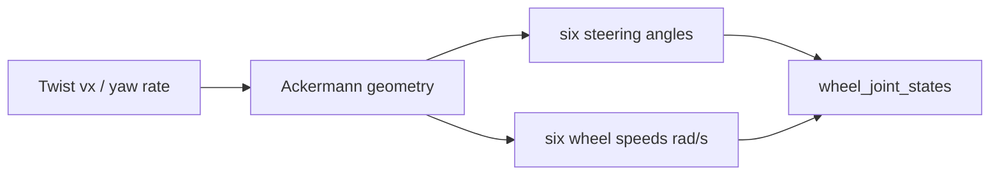

# Ackermann controller

> Code is truth — values below describe; YAML/source linked wins on conflict.

Purpose: convert a commanded body-frame `Twist` into six steering angles and
wheel speeds. Wheel arrays use front-left, front-right, centre-left,
centre-right, rear-left, rear-right order, shared with `wheel_odometry`.

Where: `src/control/ackermann_controller/`
([GitHub](https://github.com/richarJ2002/lunar_simulator/blob/main/src/control/ackermann_controller/)).

## Topics

| Direction | Name |
|---|---|
| In | `/alpha/control/cmd/velocity` (`geometry_msgs/Twist`) |
| Out | `/alpha/control/cmd/wheel_joint_states` (`actuator_msgs/Actuators`) |

Names verified from `AckermannControllerNodeClass.h` topic defaults
(`system_name` rooted, default `alpha`). No QoS claims — see source.

## Key files

| Class / unit | Path | GitHub |
|---|---|---|
| `AckermannControllerNode` | `src/control/ackermann_controller/objects/AckermannControllerNodeClass.h` | [link](https://github.com/richarJ2002/lunar_simulator/blob/main/src/control/ackermann_controller/objects/AckermannControllerNodeClass.h) |
| Velocity callback | `src/control/ackermann_controller/methods/handleVelocityCommandCallBack.cc` | [link](https://github.com/richarJ2002/lunar_simulator/blob/main/src/control/ackermann_controller/methods/handleVelocityCommandCallBack.cc) |
| Steering geometry | `src/control/ackermann_controller/methods/computeSteeringAngle.cc` | [link](https://github.com/richarJ2002/lunar_simulator/blob/main/src/control/ackermann_controller/methods/computeSteeringAngle.cc) |
| Wheel speeds | `src/control/ackermann_controller/methods/computeWheelSpeed_radPs.cc` | [link](https://github.com/richarJ2002/lunar_simulator/blob/main/src/control/ackermann_controller/methods/computeWheelSpeed_radPs.cc) |

No function signatures in v1 — see source.

## Parameters

Full authority:
[ackermann_controller.yaml](https://github.com/richarJ2002/lunar_simulator/blob/main/parameters/systems/alpha/alpha_control/ackermann_controller.yaml).
What each tunes: command/output topic names; wheel radius (m) and per-wheel
positions (m, six-wheel order — keep in sync with the Alpha model and
`wheel_odometry.yaml`); per-wheel drive-direction multipliers; maximum wheel
speed (rad/s clamp).

