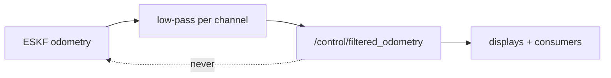

# Estimate filter

> Code is truth — values below describe; YAML/source linked wins on conflict.

Purpose: low-pass smoothing of the fused ESKF odometry for display and
downstream consumers. Output goes to `/alpha/control/filtered_odometry` and
is **never fed back into the ESKF** — the filter loop stays open by design.

Where: `src/control/estimate_filter/`
([GitHub](https://github.com/richarJ2002/space_robotics_simulator/blob/main/src/control/estimate_filter/)).

## Topics

| Direction | Name |
|---|---|
| In | `/alpha/localisation/kalman_filter/odometry` |
| Out | `/alpha/control/filtered_odometry` |

Names verified from `EstimateLowPassFilterNodeClass.h` topic defaults
(`system_name` rooted, default `alpha`). No QoS claims — see source.

## Key files

| Class / unit | Path | GitHub |
|---|---|---|
| `EstimateLowPassFilterNode` | `src/control/estimate_filter/objects/EstimateLowPassFilterNodeClass.h` | [link](https://github.com/richarJ2002/space_robotics_simulator/blob/main/src/control/estimate_filter/objects/EstimateLowPassFilterNodeClass.h) |
| Filter core | `src/control/estimate_filter/objects/EstimateLowPassFilterClass.h` | [link](https://github.com/richarJ2002/space_robotics_simulator/blob/main/src/control/estimate_filter/objects/EstimateLowPassFilterClass.h) |
| Filter step | `src/control/estimate_filter/methods/EstimateLowPassFilter/update.cc` | [link](https://github.com/richarJ2002/space_robotics_simulator/blob/main/src/control/estimate_filter/methods/EstimateLowPassFilter/update.cc) |
| Odometry callback | `src/control/estimate_filter/methods/EstimateLowPassFilterNode/handleOdometryCallBack.cc` | [link](https://github.com/richarJ2002/space_robotics_simulator/blob/main/src/control/estimate_filter/methods/EstimateLowPassFilterNode/handleOdometryCallBack.cc) |

No function signatures in v1 — see source.

## Parameters

Full authority:
[estimate_low_pass_filter.yaml](https://github.com/richarJ2002/space_robotics_simulator/blob/main/parameters/systems/alpha/alpha_control/estimate_low_pass_filter.yaml).
What each tunes: input/output topic names; velocity, position, and attitude
cutoff frequencies (Hz, per-channel smoothing); maximum accepted message gap
(s, guards against stale-sample smoothing).

