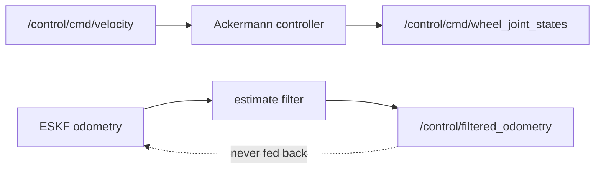

# Control

> Code is truth — values below describe; YAML/source linked wins on conflict.

Purpose: turn commanded body velocity into six-wheel steering commands, and
offer a smoothed copy of the fused estimate for display and downstream use.
Control never estimates — it consumes the ESKF output, and the smoothed copy
is never fed back into the ESKF.

Where: `src/control/`
([GitHub](https://github.com/richarJ2002/space_robotics_simulator/blob/main/src/control/)).

## Pages

- [Ackermann controller](ackermann-controller.md) — steering geometry and
  per-wheel speeds in six-wheel order.
- [Estimate filter](estimate-filter.md) — low-pass on the fused estimate;
  display only, never fed back into the ESKF.
