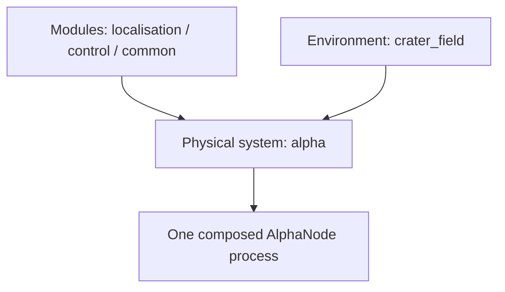

# Modules

> Code is truth — values below describe; YAML/source linked wins on conflict.

Three kinds of things live in this repo. Mixing them up is the usual
confusion, so fix the mental model first:

- **Module** — reusable library under `src/` (`localisation`, `control`,
  `common`). A module never names a world, a launch file, or a physical
  system. The modules in the repo today are the basic first implementations
  currently being worked on; more algorithms and new modules will follow.
- **System** — one physical rover stack under `src/systems/<name>/` plus its
  `parameters/systems/<name>/` tuning (see Systems/Alpha — later work
  package). A system composes modules: Alpha composes them today as the
  current physical system, and a future system would compose the same or
  extended ones. Systems own the ESKF model, the driver, and the supervisor.
- **Environment** — one world under `environment/` (see Environments).
  Modules and systems never hardcode an environment.

## Where to go

- [Localisation](localisation/index.md) — measurement producers plus the
  model-agnostic Kalman engine. The rover-specific ESKF model belongs to
  Systems/Alpha, not here.
- [Control](control/index.md) — Ackermann steering geometry plus the
  display-only estimate filter.
- [Common](common/index.md) — console logging macros and diagnostics
  helpers shared by every node.
