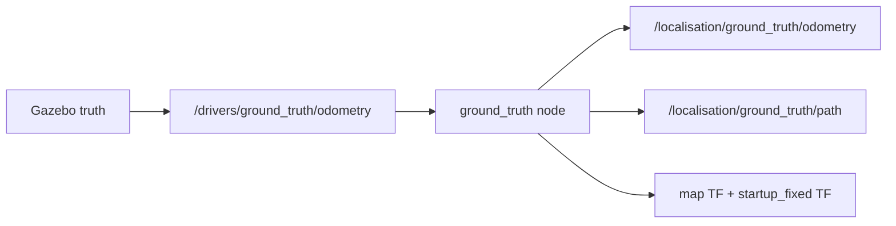

# Ground truth

> Code is truth — values below describe; YAML/source linked wins on conflict.

Purpose: republish simulator truth as comparison odometry, a retained path
history, and TF. Bypasses the sensor-noise path, so it stays noise-free.
Ground truth alone establishes the static `map -> <system>/startup_fixed`
transform the estimators start under.

Where: `src/localisation/ground_truth/`
([GitHub](https://github.com/richarJ2002/space_robotics_simulator/blob/main/src/localisation/ground_truth/)).

## Topics

| Direction | Name |
|---|---|
| In | `/alpha/drivers/ground_truth/odometry` |
| Out | `/alpha/localisation/ground_truth/odometry` |
| Out | `/alpha/localisation/ground_truth/path` |

Names verified from `GroundTruthNodeClass.h` topic defaults
(`system_name` rooted, default `alpha`). No QoS claims — see source.

## Key files

| Class / unit | Path | GitHub |
|---|---|---|
| `GroundTruthNode` | `src/localisation/ground_truth/objects/GroundTruthNodeClass.h` | [link](https://github.com/richarJ2002/space_robotics_simulator/blob/main/src/localisation/ground_truth/objects/GroundTruthNodeClass.h) |
| Odometry callback | `src/localisation/ground_truth/methods/handleOdometryCallBack.cc` | [link](https://github.com/richarJ2002/space_robotics_simulator/blob/main/src/localisation/ground_truth/methods/handleOdometryCallBack.cc) |
| Path history | `src/localisation/ground_truth/methods/appendPathPose.cc` | [link](https://github.com/richarJ2002/space_robotics_simulator/blob/main/src/localisation/ground_truth/methods/appendPathPose.cc) |
| TF publish | `src/localisation/ground_truth/methods/publishTransform.cc`, `publishStartupFixedTransform.cc` | [link](https://github.com/richarJ2002/space_robotics_simulator/blob/main/src/localisation/ground_truth/methods/publishTransform.cc) |

No function signatures in v1 — see source.

## Parameters

Full authority:
[ground_truth.yaml](https://github.com/richarJ2002/space_robotics_simulator/blob/main/parameters/systems/alpha/alpha_localisation/ground_truth.yaml).
What each group tunes: input/output/path topic names; `map_frame`,
`startup_fixed_frame`, and truth base frame names; path history length and
sampling period (poses, seconds). Frames are TF frame names.

