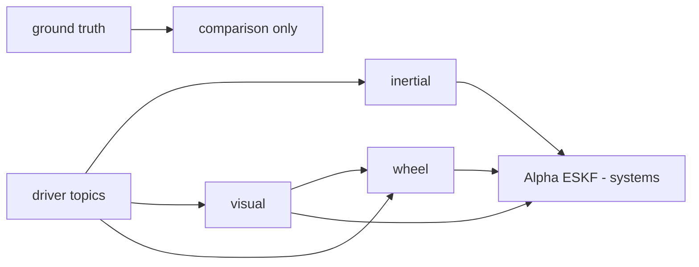

# Localisation

> Code is truth — values below describe; YAML/source linked wins on conflict.

Purpose: turn raw drivers into body motion measurements and fuse them.
Independent **producers** (ground truth, inertial, visual, wheel) each
publish odometry; the Alpha ESKF fuses a subset of them. The ESKF's
rover-specific model (`alpha_kalman_filter`) belongs to Systems/Alpha —
this section covers the producers and the shared engine only.

Where: `src/localisation/`
([GitHub](https://github.com/richarJ2002/space_robotics_simulator/blob/main/src/localisation/)).

Migrated once from `src/localisation/README.md` (that table is the source
of this section's topic wiring — linked here, not duplicated there):

| Producer | Subscribes | Publishes |
|---|---|---|
| `alpha_driver_node` (systems, not here) | `/alpha/drivers/imu`, `/alpha/drivers/joint_states` | `/alpha/imu`, `/alpha/joint_states` |
| `inertial_odometry` | `/alpha/imu` | `/alpha/localisation/inertial/odometry`, `/alpha/localisation/inertial/filtered_imu` |
| `visual_odometry` | `/alpha/drivers/loccam/left`, `/alpha/drivers/loccam/right` | `/alpha/localisation/visual/odometry`, `/alpha/localisation/visual/point_cloud`, `/alpha/localisation/visual/features` |
| `wheel_odometry` | `/alpha/joint_states`, `/alpha/localisation/visual/odometry`, `/alpha/localisation/kalman_filter/wheel_slip_ratio` | `/alpha/localisation/wheel/odometry`, `/alpha/localisation/wheel/slip_ratios`, `/alpha/localisation/wheel/slip_observation` |
| `continuous_ekf` (systems, not here) | `/alpha/imu`, visual pose, wheel body velocity | `/alpha/localisation/kalman_filter/odometry` et al. |
| `ground_truth` | `/alpha/drivers/ground_truth/odometry` | `/alpha/localisation/ground_truth/odometry`, `/alpha/localisation/ground_truth/path` |

Conventions: local estimators start at identity in `<system>/startup_fixed`;
ground truth alone anchors `map -> <system>/startup_fixed`.
`nav_msgs/Odometry.twist` is expressed in the child body frame.

## Pages

- [Ground truth](ground-truth.md) — noise-free comparison path and TF.
- [Inertial odometry](inertial-odometry.md) — filtered IMU plus standalone
  integrated pose (not fused).
- [Visual odometry](visual-odometry.md) — metric stereo VO plus the
  dependency-free feature-tracking library.
- [Wheel odometry](wheel-odometry.md) — six-wheel least-squares solve with
  visual slip observation.
- [Kalman engine](kalman-engine.md) — model-agnostic continuous-discrete EKF.
