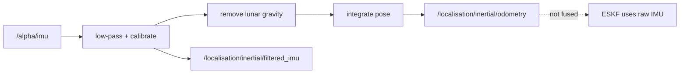

# Inertial odometry

> Code is truth — values below describe; YAML/source linked wins on conflict.

Purpose: standalone inertial estimator for diagnostics. Low-pass filters the
IMU, calibrates bias at startup, removes lunar gravity, and integrates pose.
Its filtered acceleration and integrated pose are **not** fused — the ESKF
consumes raw `/alpha/imu` so visual attitude corrections affect all
subsequent gravity projection.

Where: `src/localisation/inertial_odometry/`
([GitHub](https://github.com/richarJ2002/lunar_simulator/blob/main/src/localisation/inertial_odometry/)).

## Topics

| Direction | Name |
|---|---|
| In | `/alpha/imu` |
| Out | `/alpha/localisation/inertial/odometry` |
| Out | `/alpha/localisation/inertial/filtered_imu` |
| Out | `/alpha/diagnostics` (`DiagnosticArray` readiness) |

Names verified from `InertialOdometryNodeClass.h` topic defaults
(`system_name` rooted, default `alpha`). No QoS claims — see source.

## Key files

| Class / unit | Path | GitHub |
|---|---|---|
| `InertialOdometryNode` | `src/localisation/inertial_odometry/objects/InertialOdometryNodeClass.h` | [link](https://github.com/richarJ2002/lunar_simulator/blob/main/src/localisation/inertial_odometry/objects/InertialOdometryNodeClass.h) |
| IMU callback | `src/localisation/inertial_odometry/methods/handleImuCallBack.cc` | [link](https://github.com/richarJ2002/lunar_simulator/blob/main/src/localisation/inertial_odometry/methods/handleImuCallBack.cc) |
| Gravity removal | `src/localisation/inertial_odometry/methods/calculateGravityFreeAccelerationFixed.cc` | [link](https://github.com/richarJ2002/lunar_simulator/blob/main/src/localisation/inertial_odometry/methods/calculateGravityFreeAccelerationFixed.cc) |
| Odometry publish | `src/localisation/inertial_odometry/methods/publishOdometry.cc` | [link](https://github.com/richarJ2002/lunar_simulator/blob/main/src/localisation/inertial_odometry/methods/publishOdometry.cc) |

No function signatures in v1 — see source.

## Parameters

Full authority:
[inertial_odometry.yaml](https://github.com/richarJ2002/lunar_simulator/blob/main/parameters/systems/alpha/alpha_localisation/inertial_odometry.yaml).
What each tunes: IMU/odometry/filtered-IMU topic names; odom and base frame
names; low-pass cutoff (Hz); gravity-removal toggle; maximum IMU step (s);
startup calibration sample count; angular-rate deadband (rad/s, floors gyro
noise before integration).

