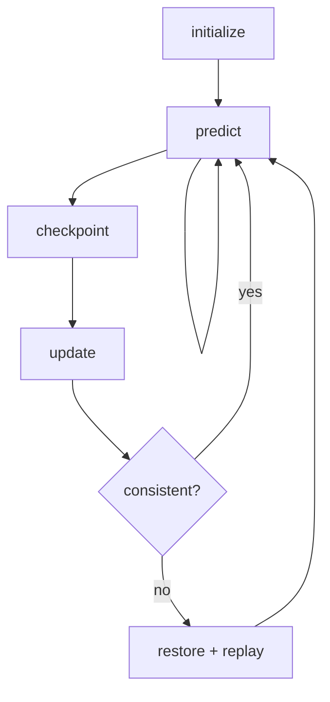

# Kalman engine

> Code is truth — values below describe; YAML/source linked wins on conflict.

Purpose: model-agnostic continuous-discrete extended Kalman filter —
predict/propagate, correct/update, checkpoint, and restore. Pure linear
algebra with no ROS dependency and no rover model. The rover-specific Alpha
ESKF model (`alpha_kalman_filter`: 15-component error state, NIS gating,
rollback/replay) belongs to Systems/Alpha, not here.

Where: `src/localisation/kalman_filter/ekf_continuous_kalman_filter/`
([GitHub](https://github.com/richarJ2002/space_robotics_simulator/blob/main/src/localisation/kalman_filter/ekf_continuous_kalman_filter/)).

## Topics

None — library only. No publishers, no subscriptions, no parameters.

## Key files

| Class / unit | Path | GitHub |
|---|---|---|
| `ContinuousExtendedKalmanFilter` | `src/localisation/kalman_filter/ekf_continuous_kalman_filter/objects/ContinuousExtendedKalmanFilterClass.h` | [link](https://github.com/richarJ2002/space_robotics_simulator/blob/main/src/localisation/kalman_filter/ekf_continuous_kalman_filter/objects/ContinuousExtendedKalmanFilterClass.h) |
| Filter status | `src/localisation/kalman_filter/ekf_continuous_kalman_filter/objects/FilterStatusEnum.h` | [link](https://github.com/richarJ2002/space_robotics_simulator/blob/main/src/localisation/kalman_filter/ekf_continuous_kalman_filter/objects/FilterStatusEnum.h) |
| Predict step | `src/localisation/kalman_filter/ekf_continuous_kalman_filter/methods/predict.cc` | [link](https://github.com/richarJ2002/space_robotics_simulator/blob/main/src/localisation/kalman_filter/ekf_continuous_kalman_filter/methods/predict.cc) |
| Update step | `src/localisation/kalman_filter/ekf_continuous_kalman_filter/methods/update.cc` | [link](https://github.com/richarJ2002/space_robotics_simulator/blob/main/src/localisation/kalman_filter/ekf_continuous_kalman_filter/methods/update.cc) |
| Checkpoint/restore | `src/localisation/kalman_filter/ekf_continuous_kalman_filter/methods/restore.cc` | [link](https://github.com/richarJ2002/space_robotics_simulator/blob/main/src/localisation/kalman_filter/ekf_continuous_kalman_filter/methods/restore.cc) |

No function signatures in v1 — see source.

## Parameters

None at this layer. Tuning (process/measurement noise, gating, replay
horizon) lives in the Alpha ESKF YAML owned by Systems/Alpha.

