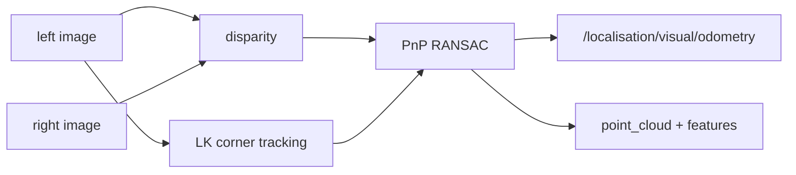

# Visual odometry

> Code is truth — values below describe; YAML/source linked wins on conflict.

Purpose: metric stereo visual odometry. Computes disparity, tracks image
corners between LocCam frames with pyramidal Lucas-Kanade flow, and estimates
the inter-frame transform with PnP RANSAC. Withholds odometry corrections
when too few reliable matches exist; the cloud and feature image publish for
every synchronized stereo frame, including empty clouds.

Where: `src/localisation/visual_odometry/`
([GitHub](https://github.com/richarJ2002/lunar_simulator/blob/main/src/localisation/visual_odometry/)).
The dependency-free tracker lives in `feature_tracking/`
([GitHub](https://github.com/richarJ2002/lunar_simulator/blob/main/src/localisation/visual_odometry/feature_tracking/))
under the `jsf-av-cpp` overlay — see the compliance evidence on `main`
([applicability profile](https://github.com/richarJ2002/lunar_simulator/blob/main/docs/compliance/feature_tracking/JSF_AV_APPLICABILITY_PROFILE.md),
[deviation log](https://github.com/richarJ2002/lunar_simulator/blob/main/docs/compliance/feature_tracking/DEVIATION_LOG.md)).
Overlay rules (no exceptions, no heap after init, checked
`FeatureTrackingStatus`) apply to that directory only, not to the ROS/OpenCV
wrapper. Compliance wiring pages arrive in a later work package.

## Topics

| Direction | Name |
|---|---|
| In | `/alpha/drivers/loccam/left` |
| In | `/alpha/drivers/loccam/right` |
| In | `/alpha/localisation/visual/reset` |
| Out | `/alpha/localisation/visual/odometry` |
| Out | `/alpha/localisation/visual/point_cloud` |
| Out | `/alpha/localisation/visual/features` |
| Out | `/alpha/diagnostics` (`DiagnosticArray` readiness) |

Names verified from `VisualOdometryNodeClass.h` topic defaults
(`system_name` rooted, default `alpha`). No QoS claims — see source.

## Key files

| Class / unit | Path | GitHub |
|---|---|---|
| `VisualOdometryNode` | `src/localisation/visual_odometry/visual_odometry_node/objects/VisualOdometryNodeClass.h` | [link](https://github.com/richarJ2002/lunar_simulator/blob/main/src/localisation/visual_odometry/visual_odometry_node/objects/VisualOdometryNodeClass.h) |
| Stereo callback | `src/localisation/visual_odometry/visual_odometry_node/methods/handleStereoCallBack.cc` | [link](https://github.com/richarJ2002/lunar_simulator/blob/main/src/localisation/visual_odometry/visual_odometry_node/methods/handleStereoCallBack.cc) |
| LK tracker | `src/localisation/visual_odometry/feature_tracking/objects/PyramidalLucasKanadeTracker.h` | [link](https://github.com/richarJ2002/lunar_simulator/blob/main/src/localisation/visual_odometry/feature_tracking/objects/PyramidalLucasKanadeTracker.h) |
| Corner detector | `src/localisation/visual_odometry/feature_tracking/objects/ShiTomasiCornerDetector.h` | [link](https://github.com/richarJ2002/lunar_simulator/blob/main/src/localisation/visual_odometry/feature_tracking/objects/ShiTomasiCornerDetector.h) |
| Tracking status | `src/localisation/visual_odometry/feature_tracking/objects/FeatureTrackingStatus.h` | [link](https://github.com/richarJ2002/lunar_simulator/blob/main/src/localisation/visual_odometry/feature_tracking/objects/FeatureTrackingStatus.h) |

No function signatures in v1 — see source.

## Parameters

Full authority:
[visual_odometry.yaml](https://github.com/richarJ2002/lunar_simulator/blob/main/parameters/systems/alpha/alpha_localisation/visual_odometry.yaml).
What each tunes: image/odometry/cloud/feature-image/reset topic names; odom
and base frame names; intrinsics (px) and stereo baseline (m) matching the
Alpha SDF; camera-to-body position (m) and pitch (rad); disparity and feature
counts/thresholds; maximum usable depth (m) and stereo-matching mode.

