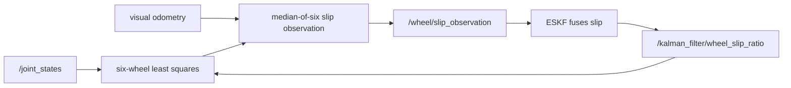

# Wheel odometry

> Code is truth — values below describe; YAML/source linked wins on conflict.

Purpose: six-wheel steering odometry. Solves all six rolling constraints in
least squares, so arbitrary per-wheel Ackermann angles are supported, and
estimates longitudinal slip against visual odometry. Wheel arrays use
front-left, front-right, centre-left, centre-right, rear-left, rear-right
order everywhere. The lateral (vy) channel is unobservable with near-parallel
wheels and is floored to zero instead of amplifying steering-encoder noise.

Where: `src/localisation/wheel_odometry/`
([GitHub](https://github.com/richarJ2002/space_robotics_simulator/blob/main/src/localisation/wheel_odometry/)).

## Topics

| Direction | Name |
|---|---|
| In | `/alpha/joint_states` |
| In | `/alpha/localisation/visual/odometry` |
| In | `/alpha/localisation/kalman_filter/wheel_slip_ratio` |
| Out | `/alpha/localisation/wheel/odometry` |
| Out | `/alpha/localisation/wheel/slip_ratios` |
| Out | `/alpha/localisation/wheel/slip_observation` |
| Out | `/alpha/diagnostics` (`DiagnosticArray` readiness) |

Names verified from `WheelOdometryNodeClass.h` topic defaults
(`system_name` rooted, default `alpha`). No QoS claims — see source.
`/alpha/localisation/wheel/slip_ratios` publishes the applied values in the
six-wheel order above.

## Key files

| Class / unit | Path | GitHub |
|---|---|---|
| `WheelOdometryNode` | `src/localisation/wheel_odometry/objects/WheelOdometryNodeClass.h` | [link](https://github.com/richarJ2002/space_robotics_simulator/blob/main/src/localisation/wheel_odometry/objects/WheelOdometryNodeClass.h) |
| Joint-state callback | `src/localisation/wheel_odometry/methods/handleJointStateCallBack.cc` | [link](https://github.com/richarJ2002/space_robotics_simulator/blob/main/src/localisation/wheel_odometry/methods/handleJointStateCallBack.cc) |
| Slip observation | `src/localisation/wheel_odometry/methods/publishSlipObservation.cc` | [link](https://github.com/richarJ2002/space_robotics_simulator/blob/main/src/localisation/wheel_odometry/methods/publishSlipObservation.cc) |
| Odometry publish | `src/localisation/wheel_odometry/methods/publishOdometry.cc` | [link](https://github.com/richarJ2002/space_robotics_simulator/blob/main/src/localisation/wheel_odometry/methods/publishOdometry.cc) |

No function signatures in v1 — see source.

## Parameters

Full authority:
[wheel_odometry.yaml](https://github.com/richarJ2002/space_robotics_simulator/blob/main/parameters/systems/alpha/alpha_localisation/wheel_odometry.yaml).
What each tunes: joint-state/visual/slip topic names; odom and base frame
names; wheel radius (m, keep in sync with the Alpha model and
`ackermann_controller.yaml`); encoder/slip noise (rad/s, m/s); integration
and readiness timing (s); slip-estimation gains, deadband, and clamp — each
wheel speed is scaled by `(1 - slip_ratio)` before integration. The
configured `slip_ratios` are only the startup prior until the first fused
estimate arrives.

