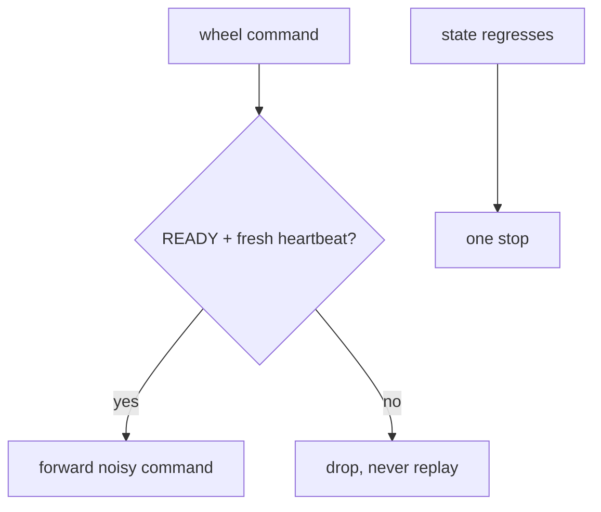

# Alpha drivers

> Code is truth — values below describe; YAML/source linked wins on conflict.

Purpose: Alpha's Gazebo hardware interface. Raw simulator reads enter
under `/alpha/drivers`, get whitened with noise, and leave as the public
sensor topics; wheel commands travel the reverse path through a
READY-gated stop-or-forward gate.

Where: `src/systems/alpha/alpha_drivers/`
([GitHub](https://github.com/richarJ2002/lunar_simulator/blob/main/src/systems/alpha/alpha_drivers/)).

## Topics

| Direction | Name |
|---|---|
| In (raw) | `/alpha/drivers/imu` |
| In (raw) | `/alpha/drivers/joint_states` |
| Out (public) | `/alpha/imu` |
| Out (public) | `/alpha/joint_states` |
| In (public command) | `/alpha/control/cmd/wheel_joint_states` |
| Out (raw command) | `/alpha/drivers/cmd/wheel_joint_states` |
| In (gate) | `/alpha/system/state` |
| Out | `/alpha/diagnostics` (`DiagnosticArray` readiness + gate counters) |

Names verified from the `configure*Interface`/`configureCommandGate`
defaults (`system_name` rooted, default `alpha`). No QoS claims — see
source. Raw ground truth also crosses the bridge under
`/alpha/drivers/ground_truth/odometry` (code wins: README's
`/alpha/localisation/...` input cell is stale); this node never touches
camera topics.

## Key files

| Class / unit | Path | GitHub |
|---|---|---|
| `AlphaDriverNode` | `src/systems/alpha/alpha_drivers/objects/AlphaDriverNodeClass.h` | [link](https://github.com/richarJ2002/lunar_simulator/blob/main/src/systems/alpha/alpha_drivers/objects/AlphaDriverNodeClass.h) |
| Gate decision | `src/systems/alpha/alpha_drivers/methods/evaluateCommandGate.cc` | [link](https://github.com/richarJ2002/lunar_simulator/blob/main/src/systems/alpha/alpha_drivers/methods/evaluateCommandGate.cc) |
| State receipt | `src/systems/alpha/alpha_drivers/methods/handleSystemStateCallBack.cc` | [link](https://github.com/richarJ2002/lunar_simulator/blob/main/src/systems/alpha/alpha_drivers/methods/handleSystemStateCallBack.cc) |
| Gated publish | `src/systems/alpha/alpha_drivers/methods/publishNoisyWheelCommandCallBack.cc` | [link](https://github.com/richarJ2002/lunar_simulator/blob/main/src/systems/alpha/alpha_drivers/methods/publishNoisyWheelCommandCallBack.cc) |

No function signatures in v1 — see source.

## Parameters

Full authority:
[alpha_drivers.yaml](https://github.com/richarJ2002/lunar_simulator/blob/main/parameters/systems/alpha/alpha_drivers/alpha_drivers.yaml).
What each group tunes: raw/public topic names; IMU, joint-state, and
wheel-command noise (stddevs, biases, seed); joint-state publish rate;
heartbeat/readiness ages; wheel-speed clamp. Never paste numbers as
authority — see the YAML.

## Command gate

Motion commands are obeyed only while the supervisor's latched state is
`READY` with a fresh heartbeat; everything else is dropped, counted, and
never replayed, and a gate that closes after being open sends one stop.
Wait for READY with `scripts/wait_for_system_ready.py` before commanding.

