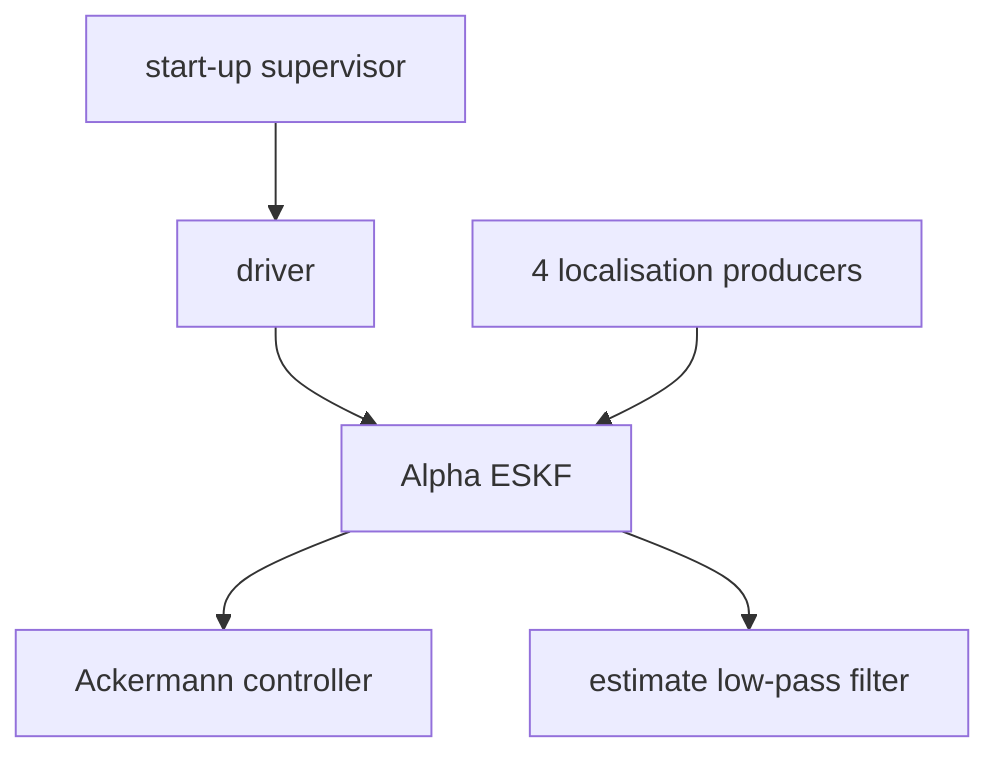

# Alpha

> Code is truth — values below describe; YAML/source linked wins on conflict.

Purpose: Alpha is the first and currently only rover system — a six-wheel
Ackermann rover driven by one `AlphaNode` process. It fuses four odometry
producers through an Alpha-specific ESKF and gates motion on start-up
readiness.

Where: `src/systems/alpha/`
([GitHub](https://github.com/richarJ2002/lunar_simulator/blob/main/src/systems/alpha/)).

## Single-process composition

One `AlphaNode` owns nine nodes on one `MultiThreadedExecutor`: the
driver, four localisation producers (ground truth, inertial, visual,
wheel), the Alpha ESKF, the Ackermann controller, the estimate low-pass
filter, and the start-up supervisor. The filtered estimate on
`/alpha/control/filtered_odometry` is never fed back into the ESKF.

## Frames

Local estimators use `<system>/startup_fixed` (default
`alpha/startup_fixed`), anchored under `map` by ground truth alone.
`nav_msgs/Odometry.twist` is expressed in the child body frame.

