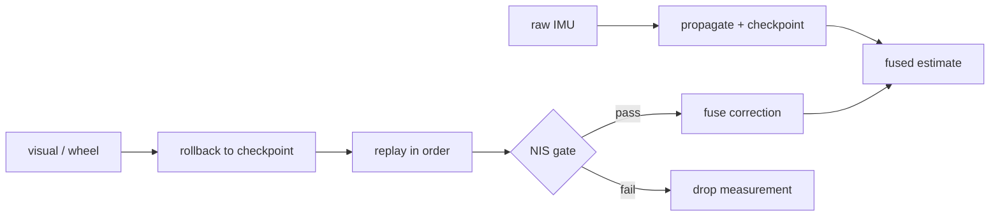

# Alpha localisation filter

> Code is truth — values below describe; YAML/source linked wins on conflict.

Purpose: Alpha's model-specific ESKF wrapper. It fuses raw IMU, visual,
and wheel odometry into one pose/twist estimate, while the reusable linear
algebra lives in the model-agnostic engine.

Where: `src/systems/alpha/alpha_localisation/alpha_kalman_filter/`
([GitHub](https://github.com/richarJ2002/lunar_simulator/blob/main/src/systems/alpha/alpha_localisation/alpha_kalman_filter/));
engine: `src/localisation/kalman_filter/`
([GitHub](https://github.com/richarJ2002/lunar_simulator/blob/main/src/localisation/kalman_filter/)).

## Topics

| Direction | Name |
|---|---|
| In | `/alpha/imu` |
| In | `/alpha/localisation/visual/odometry` |
| In | `/alpha/localisation/wheel/odometry` |
| Out | `/alpha/localisation/kalman_filter/odometry` |
| Out | `/alpha/localisation/kalman_filter/path` |
| Out | `/alpha/localisation/kalman_filter/wheel_slip_ratio` |
| Out | `/alpha/diagnostics` (`DiagnosticArray` readiness) |

Names verified from `AlphaKalmanFilterNodeClass.h` topic defaults
(`system_name` rooted, default `alpha`). No QoS claims — see source.
Twist is expressed in the child body frame.

## Key files

| Class / unit | Path | GitHub |
|---|---|---|
| `AlphaKalmanFilterNode` | `src/systems/alpha/alpha_localisation/alpha_kalman_filter/objects/AlphaKalmanFilterNodeClass.h` | [link](https://github.com/richarJ2002/lunar_simulator/blob/main/src/systems/alpha/alpha_localisation/alpha_kalman_filter/objects/AlphaKalmanFilterNodeClass.h) |
| IMU callback | `src/systems/alpha/alpha_localisation/alpha_kalman_filter/methods/handleImuCallBack.cc` | [link](https://github.com/richarJ2002/lunar_simulator/blob/main/src/systems/alpha/alpha_localisation/alpha_kalman_filter/methods/handleImuCallBack.cc) |
| Measurement callback | `src/systems/alpha/alpha_localisation/alpha_kalman_filter/methods/handleMeasurementCallBack.cc` | [link](https://github.com/richarJ2002/lunar_simulator/blob/main/src/systems/alpha/alpha_localisation/alpha_kalman_filter/methods/handleMeasurementCallBack.cc) |
| Replay after rollback | `src/systems/alpha/alpha_localisation/alpha_kalman_filter/methods/replayMeasurementsAfter.cc` | [link](https://github.com/richarJ2002/lunar_simulator/blob/main/src/systems/alpha/alpha_localisation/alpha_kalman_filter/methods/replayMeasurementsAfter.cc) |

No function signatures in v1 — see source.

## Parameters

Full authority (note the top-level key is `continuous_ekf`, not the
directory name):
[alpha_kalman_filter.yaml](https://github.com/richarJ2002/lunar_simulator/blob/main/parameters/systems/alpha/alpha_localisation/alpha_kalman_filter.yaml).
What each group tunes: topic/frame names; prediction rate; measurement age
and future-stamp limits; visual/wheel fusion modes and NIS thresholds
(zero selects the automatic chi-square gate); process and measurement
noise variances; readiness thresholds. Never paste numbers as authority —
see the YAML.

## Predict/fuse flow

Raw IMU samples propagate the state; each step is checkpointed, so a
lagged visual or wheel measurement rolls back to the newest checkpoint at
or before its stamp and replays newer records in order. Each correction
passes its source's NIS gate before fusion.

