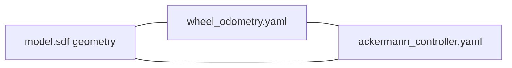

# Alpha model

> Code is truth — values below describe; YAML/source linked wins on conflict.

Purpose: Alpha's six-wheel rover SDF model and spawn assets — the geometry
the wheel odometry and Ackermann controller both assume.

Where: `src/systems/alpha/alpha_model/`
([GitHub](https://github.com/richarJ2002/space_robotics_simulator/blob/main/src/systems/alpha/alpha_model/)).

## Topics

None — a model directory, not a node. Actuator and sensor wiring crosses
the bridge under `/alpha/drivers/...` (see [Drivers](drivers.md) and
[Launch & bridge](../../launch-bridge.md)).

## Key files

| Class / unit | Path | GitHub |
|---|---|---|
| Rover model | `src/systems/alpha/alpha_model/model.sdf` | [link](https://github.com/richarJ2002/space_robotics_simulator/blob/main/src/systems/alpha/alpha_model/model.sdf) |
| Model metadata | `src/systems/alpha/alpha_model/model.config` | [link](https://github.com/richarJ2002/space_robotics_simulator/blob/main/src/systems/alpha/alpha_model/model.config) |
| RViz config | `src/systems/alpha/alpha.rviz` | [link](https://github.com/richarJ2002/space_robotics_simulator/blob/main/src/systems/alpha/alpha.rviz) |

## Parameters

No ROS parameters. Wheel geometry (radius, positions, drive-direction
signs) must stay in sync across three places — the model SDF,
[wheel_odometry.yaml](https://github.com/richarJ2002/space_robotics_simulator/blob/main/parameters/systems/alpha/alpha_localisation/wheel_odometry.yaml),
and
[ackermann_controller.yaml](https://github.com/richarJ2002/space_robotics_simulator/blob/main/parameters/systems/alpha/alpha_control/ackermann_controller.yaml).
Wheel arrays use front-left, front-right, centre-left, centre-right,
rear-left, rear-right order everywhere.

