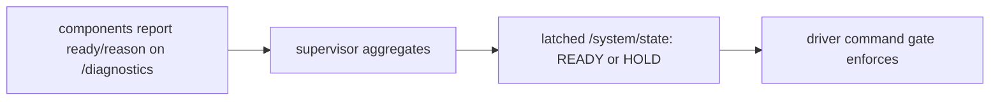

# Alpha start-up supervisor

> Code is truth — values below describe; YAML/source linked wins on conflict.

Purpose: aggregates every required component's self-reported readiness
into one latched system state the driver's command gate enforces. The
supervisor only aggregates — each component's readiness criteria live in
that component's own YAML.

Where: `src/systems/alpha/alpha_supervisor/`
([GitHub](https://github.com/richarJ2002/lunar_simulator/blob/main/src/systems/alpha/alpha_supervisor/)).

## Topics

| Direction | Name |
|---|---|
| In | `/alpha/diagnostics` (each component's `ready`/`reason` status) |
| Out | `/alpha/system/state` (`DiagnosticArray` carrying the `system_state` status) |

Names verified from `startup_supervisor.yaml` topic defaults. No QoS
claims — see source.

## Key files

| Class / unit | Path | GitHub |
|---|---|---|
| `AlphaStartupSupervisorNode` | `src/systems/alpha/alpha_supervisor/objects/AlphaStartupSupervisorNodeClass.h` | [link](https://github.com/richarJ2002/lunar_simulator/blob/main/src/systems/alpha/alpha_supervisor/objects/AlphaStartupSupervisorNodeClass.h) |
| State evaluation | `src/systems/alpha/alpha_supervisor/public_functions/evaluateSystemState.cc` | [link](https://github.com/richarJ2002/lunar_simulator/blob/main/src/systems/alpha/alpha_supervisor/public_functions/evaluateSystemState.cc) |
| State publish | `src/systems/alpha/alpha_supervisor/methods/publishSystemStateCallBack.cc` | [link](https://github.com/richarJ2002/lunar_simulator/blob/main/src/systems/alpha/alpha_supervisor/methods/publishSystemStateCallBack.cc) |

No function signatures in v1 — see source.

## Parameters

Full authority:
[startup_supervisor.yaml](https://github.com/richarJ2002/lunar_simulator/blob/main/parameters/systems/alpha/alpha_supervisor/startup_supervisor.yaml).
What each tunes: diagnostics/state topic names; required-component list
(the first still-pending one is named); minimum start-up window;
component staleness timeout; heartbeat publish period. Per-component
thresholds live in that component's file (e.g. `readiness_*` in the
odometry and filter YAMLs). Never paste numbers as authority — see the
YAML.

